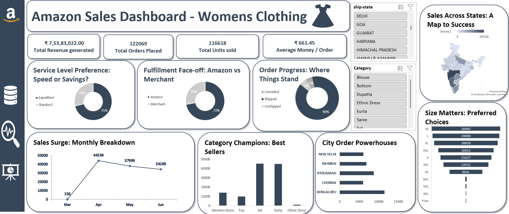

# 🛍️ Amazon Sales Dashboard – Women's Clothing (Excel Project)

> An interactive Excel dashboard analyzing Amazon Women’s Clothing sales performance across revenue, categories, cities, and customer behavior.

This is my **second Excel-based dashboard project**, built to enhance my data visualization and business analysis skills.  
It focuses on analyzing **sales performance, customer preferences, fulfillment trends, and geographic insights**.

---

## 📊 Project Overview

The **Amazon Sales Dashboard** provides a complete view of:

- Total revenue generated  
- Total orders placed  
- Total units sold  
- Average revenue per order  
- Sales distribution across states  
- Monthly sales trends  
- Category performance  
- City-wise order analysis  
- Size preference patterns  
- Order fulfillment comparison  

The goal was to transform raw sales data into a **business-ready dashboard** that supports decision-making.

---

## 📈 Key Performance Indicators (KPIs)

- **₹ 7,53,83,022.00** – Total Revenue Generated  
- **122,069** – Total Orders Placed  
- **116,618** – Total Units Sold  
- **₹ 661.45** – Average Money per Order  

These KPIs give a quick snapshot of overall performance.

---

## 🔍 Dashboard Insights

### 🔹 Service Preference
- 71% customers prefer **Expedited shipping**
- 29% choose standard delivery

### 🔹 Fulfillment Analysis
- 72% orders fulfilled by **Amazon**
- 28% fulfilled by merchants

### 🔹 Order Progress
- 90% of orders successfully shipped
- Minimal cancellations and unshipped cases

### 🔹 Monthly Sales Trend
- Major surge observed in **April**
- Slight drop in May and June
- Clear seasonal trend identification

### 🔹 Category Champions
Top performing categories:
- Set
- Kurta
- Western Dress

### 🔹 City-wise Sales Leaders
- Bengaluru
- Hyderabad
- Mumbai
- Chennai
- New Delhi

### 🔹 Size Preference Analysis
Most demanded sizes:
- M
- L
- XL

### 🔹 Geographic Analysis
State-wise sales visualization through map:
- Maharashtra and major metro regions dominate
- Clear regional sales pattern

---

## 🛠 Tools & Features Used

- **Microsoft Excel**
- Pivot Tables
- Pivot Charts
- Slicers (State & Category filters)
- KPI Cards
- Donut Charts
- Bar Charts
- Line Charts
- Map Visualization
- Dashboard layout and formatting techniques

---

## 🎯 Interactive Elements

- Ship-state filter
- Category filter
- Dynamic updates based on slicers
- Clean card-based KPI design

The dashboard updates instantly based on user selection.

---

## 🧠 Skills Demonstrated

- Data cleaning and structuring
- KPI identification
- Business insight extraction
- Visual storytelling
- Dashboard layout optimization
- Multi-dimensional filtering
- Geographic data visualization

This project reflects growth from my first dashboard in:
- Layout professionalism
- Data storytelling clarity
- Advanced chart usage
- Analytical thinking

---

## 📌 Business Value

This dashboard helps stakeholders to:

- Identify high-performing cities and states  
- Understand customer size preferences  
- Evaluate fulfillment efficiency  
- Analyze seasonal trends  
- Optimize category strategy  

---

## 📷 Dashboard Preview

---

## 🔮 Future Improvements

- Profit margin analysis  
- Customer segmentation  
- Return rate tracking  
- Advanced forecasting  
- Conversion to Power BI  

---

## 📌 Final Note

This project represents my progression in **Excel-based data analytics dashboards**.  
From understanding basic KPIs to building multi-dimensional business insights, this dashboard strengthened my analytical foundation.

Every dataset tells a story — this one tells Amazon’s Women’s Clothing story. 📊🚀

If you find it useful or inspiring, feel free to ⭐ the repository.
